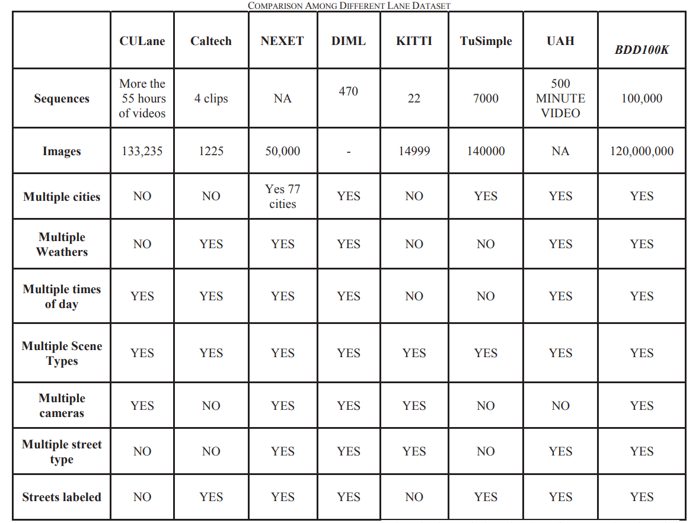
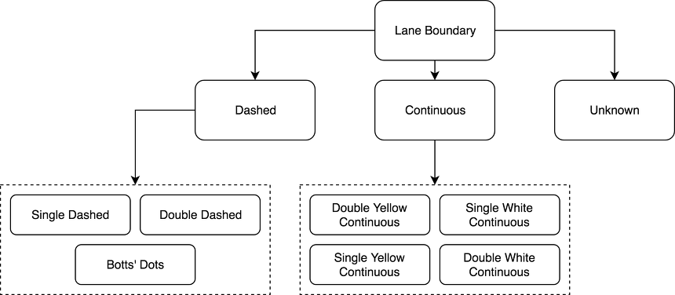
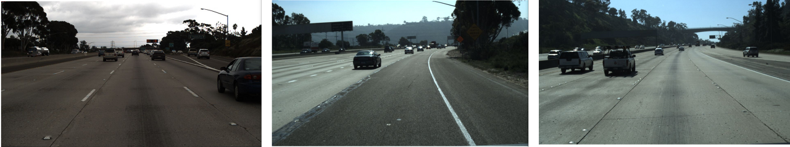
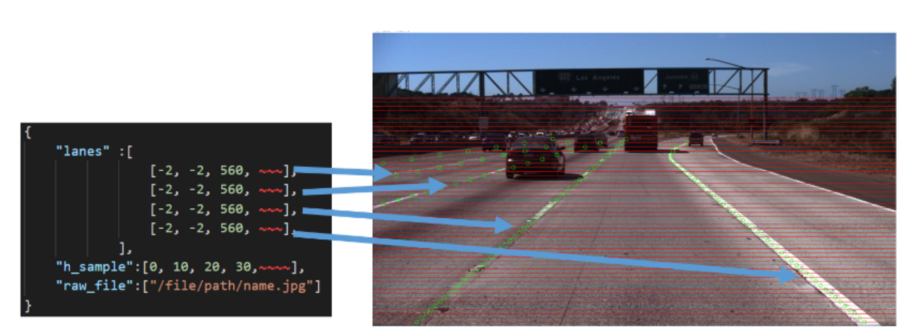
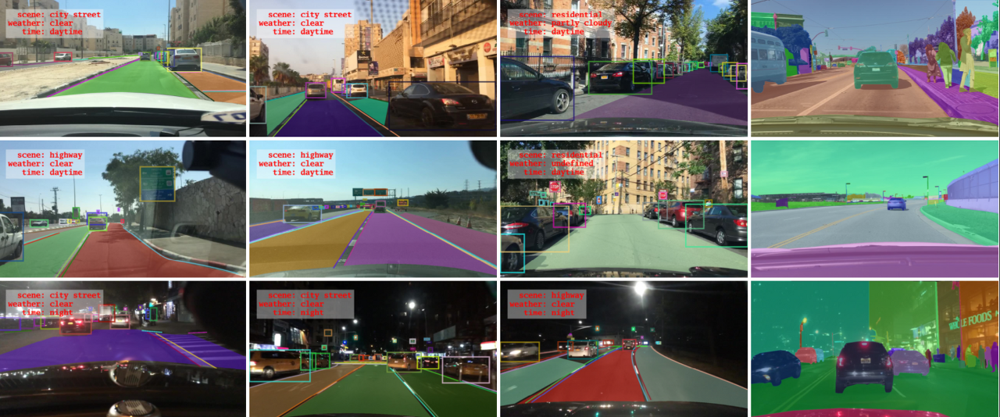
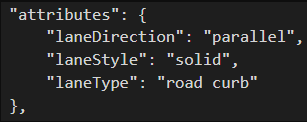
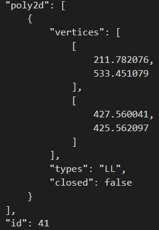
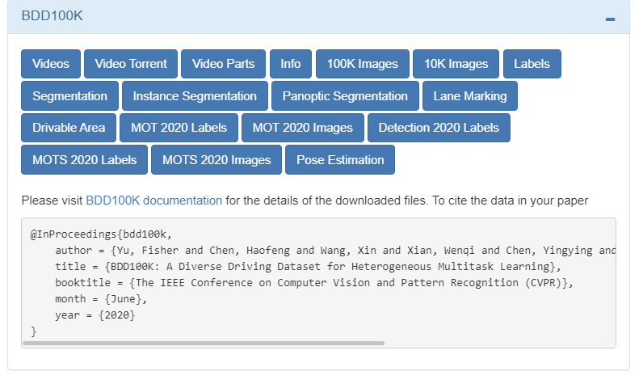

# 차선 인식 데이터셋

 

나의 경우 tusimple 또는 BDD100K

## 데이터셋 비교

### 1. tsSimple

차선인식 학습과 평가에 빈번하게 사용되는 데이터셋이다.

- 이미지 크기 : 1280 * 720(w,h)
- 데이터셋 크기 : 140,000장
    - 그러나 라벨링 되어있는 데이터는 1/20, 6000장
         - train 3626
         - valid 358
         - test 2782
    - 나머지는 흐름을 파악할 수 있도록 추가한 라벨없는 이전 프레임 이미지
- 차선 분류
    - default는 유무 판별
    - 8가지 분류 데이터셋 활용하려면 분류 코드를 실행
        - Sigle Dashed
        - Double Dashed
        - Botts' Dots
        - Double Yellow Continuous
        - Single White Continuous
        - Single Yellow Continuous
        - Double White Continuous
        - Unknown (차선 없을때)

        

        [분류 코드 github](https://github.com/fabvio/TuSimple-lane-classes)

- 특이 사항
    - 모든 데이터에 대해 19장의 연속된 이전 프레임 데이터가 존재, 즉 20장의 연속된 차선 이미지, 마지막장에만 차선 label되어 있음

장점

- 다양한 도로 환경의 데이터 존재
    - 일반 도로환경, 흐릿한 차선, 차선없이 요철로 이루어진 구간, 날씨에 관해서는 없음
- 6400장 정도면 적절한 데이터셋이므로 많은 논문에 사요되고 있다. RNN과 같이 이전 데이터를 활용해서 학습하는 네트워크에 용이
- 차선 데이터를 인스턴스 단위로 분리해서 제공해준다.

 

단점

- label이 json형태여서 픽셀 기반으로 segmentation이 되지 않음, 즉 차선 원소 개수 만큼의 차선 데이터만 존재
- h_sample에 대해 차선이 존재하면 lanes에 기록되는데, 즉 lanes의 개수만큼의 차선데이터가 기록되어 해당 h_sample 위치에 차선이 존재하면 차선의 width좌표가 들어가고, 없으면 -2가 들어간다.

 

[datasets](https://github.com/TuSimple/tusimple-benchmark/issues/3)

[papaerswithcode](https://paperswithcode.com/dataset/tusimple)

 

Representation
- [paper](https://arxiv.org/abs/1802.05591)
- [repository](https://github.com/MaybeShewill-CV/lanenet-lane-detection)

 

 

---

### 2. CULane

교통과 차선인식에 관련된 **연구**를 위한 데이터셋으로, 6개의 카메라를 통해 55시간 분량의 데이터를 수집해서, 총 133,235 프레임으로 구성되어 있다. 총 용량이 40기가가 넘는 만큼 차선인식을 위한 단일 데이터셋 중 규모가 매우 큰 편이기 때문에 차선 인식 논문에 빈번하게 사용된다. 구글 드라이브에서 다운 받을 수 있고, 6개으 서로 다른 데이터가 저장되어 있다.

- 차선 분류
    - tusimple과 동일하게 default는 유무 판별, 8가지 분류가 가능하지만 이를 하기 위해서는 분류 코드를 실행해야 함

- 데이터셋 크기
    - train 88880
    - valid 9675
    - test 34680
- 이미지 크기 : 1640 * 590
- 특이 사항
    - 사용하는 이미지의 가로가 조금 더 길다.
    - 밤에 수집한 어두운 조명 데이터가 존재한다.

장점
- 압도적으로 큰 용량의 데이터셋

 

단점
- 픽셀 단위로 분할되어 있지 않고, json도, csv도 아닌 숫자의 나열로 labeling 되어 있다. 숫자를 보면 소수로 되어있는데, 이는 차선 위치를 직접 추출한게 아니라 차선을 그린 후 3차 스플라인(cubic spline) 보간으로 얻은 함수를 제공하기 때문이다.
- 대신 이 텍스트파일을 픽셀 단위 레이블로 변환해주는 코드가 공식 사이트에 있고, 평가 과정을 도와주는 코드가 공식적으로 제공된다.

 

[공식 사이트](https://xingangpan.github.io/projects/CULane.html)

 

---

### 3. BDD100K

버클리 인공지능 연구 실험실에서 공개한 오픈소스로, 120,000,000개의 엄청난 이미지 데이터를 가진 데이터셋이다. 이미지 뿐만 아니라 GPS, IMU, timestamp까지 포함되어 있어 다양한 용도로 활용된다. 이 데이터셋은 차선인식을 위해 만들어진 데이터셋이 아니라 **도로 주행 상황에서 사용되는 모든 네트워크를 타겟으로 제작되었기 때문에 차선 뿐만 아니라 차량, 사람 등도 라벨링되어 있다.**

- 차선 분류
    - 2*2*8 + 1가지
- 데이터셋 크기
    - train : 84,000,000
    - valid + test : 36,000,000
- 이미지 크기
    - 1280 * 720

- **특이 사항**

다른 데이터셋에 비해 차선 정보가 조금 복잡하게 되어 있다.

- lanedirection : 차선의 방향 (수직 / 수평)
    - 0 : parallel
    - 1 : vertical
- lanestyle : 차선의 모양 (실선 / 점선)
    - 0 : solid
    - 1 : dashed
- lanetype : 차선의 종류 (싱글 / 더블) 과 색
    - 0 : crosswalk (횡단보도)
    - 1 : double other
    - 2 : double white
    - 3 : double yellow
    - 4 : road curb (커브길)
    - 5 : single other
    - 6 : single white
    - 7 : single yello

총 type의 개수가 2*2*8이고, 차선이 아닌 지형의 조합, 1까지 총 33개의 조합을 가진다.

 

장점
- 밤낮 시간대, 비, 흐린 날씨 등 수많은 상황이 존재한다.
- 데이터의 개수가 아주 많고, GPS, IMU에 대한 정보와 함께 객체 정보가 존재

 

단점

- poly2d 즉 두 점의 위치를 제공하기 때문에 직관적으로 파악하기 힘들다.

 

[공식 사이트](https://bair.berkeley.edu/blog/2018/05/30/bdd/)

[swithcode](https://paperswithcode.com/search?q_meta=&q_type=&q=bdd100k)

매우 다양한 용도로 구성되어 있기 때문에, 차선 인식을 위해 lane marking 을 클릭한다.

 

---

### 4. KITTI

KITTI 데이터셋은 객체 인식, 추적, 깊이 추정 등 매우 많이 사용되는 데이터셋이다. 여기에 차선 인식을 위한 데이터셋도 존재한다.

- 차선 분류
    - 3가지 (도로 전체, 주행중인 도로, 도로 x)
- 데이터셋 크기
    - train : 289
    - test : 290
- 이미지 크기
    - 1242 * 375
    - 이미지마다 조금씩 다름

- 특이 사항
    - velodain16으로 측정한 라이다 데이터도 제공

장점
- 픽셀 단위로 labeling되어 있음
- 라이다 데이터도 함께 제공

 

단점
- 데이터셋의 크기가 500으로 네트워크 학습에 사용할 수 없을 정도로 너무 작다. 그래서 검증 용도로 사용하는 것이 좋을 듯 하다.

 

[공식 사이트](http://www.cvlibs.net/datasets/kitti/eval_road.php)

 

 

### reference

- https://gnaseel.tistory.com/45
- https://gnaseel.tistory.com/46
